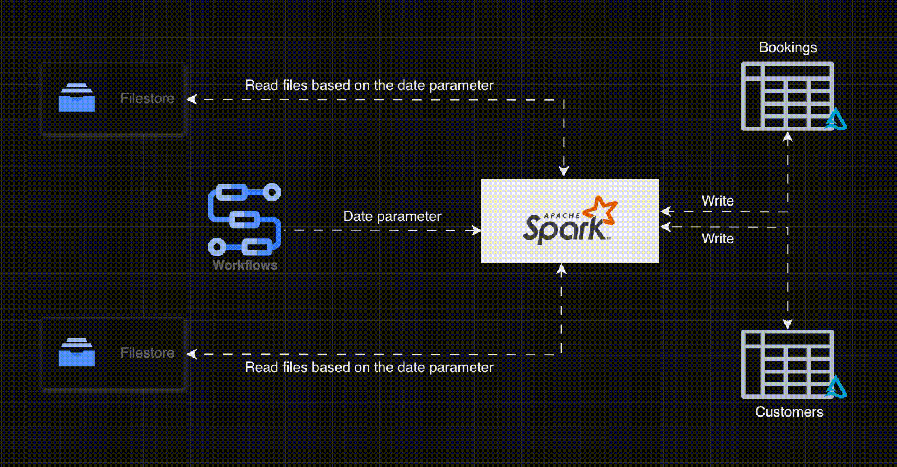

## Project: Booking.com Incremental SCD2 Merge Ingestion

### Problem Statement
This project aims to implement an incremental SCD2 merge ingestion pipeline for Booking.com data using Databricks. 
The pipeline reads daily booking and customer data, performs data quality checks, and merges the data into Delta Tables using SCD2 methodology.

### Workflow Animation
Here is a dynamic representation of the data processing workflow:




### Tech Stack
- **PySpark**
- **Databricks**
- **Delta Tables**
- **Databricks Workflow**
- **PyDeequ**

### Project Overview
1. **Read Daily Files:** Read daily files from the DBFS path based on the date parameter passed from the workflow.
2. **Transform Data:** Use PySpark notebook for data transformations and data quality checks with PyDeequ.
3. **SCD2 Merge:** Perform SCD2 type merge in Delta tables for customer data.
4. **Scheduled Workflow:** Create a scheduled workflow to automate data processing.

### Project Structure
- **`docs/`**: Contains documentation and diagrams.
- **`src/`**: Source code for transformations, data quality checks, and workflow configurations.
- **`tests/`**: Unit tests and validation scripts.
- **`notebooks/`**: Jupyter or Databricks notebooks used for data processing.
- **`data/`**: Contains sample data files for testing.

### Installation and Setup
1. **Clone the Repository:**
   ```bash
   git clone https://github.com/your-username/booking-incremental-scd2-ingestion.git
